# Vanya's Theme

<figure>
  
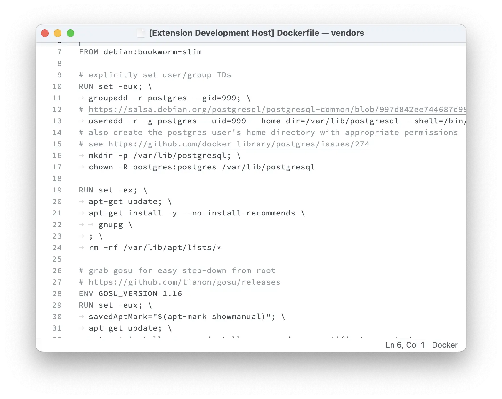

  <figcaption>
<a href="https://github.com/docker-library/postgres/blob/c86568af4a6861cb30b8f1b736b0868a3129bdd6/16/bookworm/Dockerfile">An elephant at sunset</a>
</figcaption>
</figure>
<figure>
  
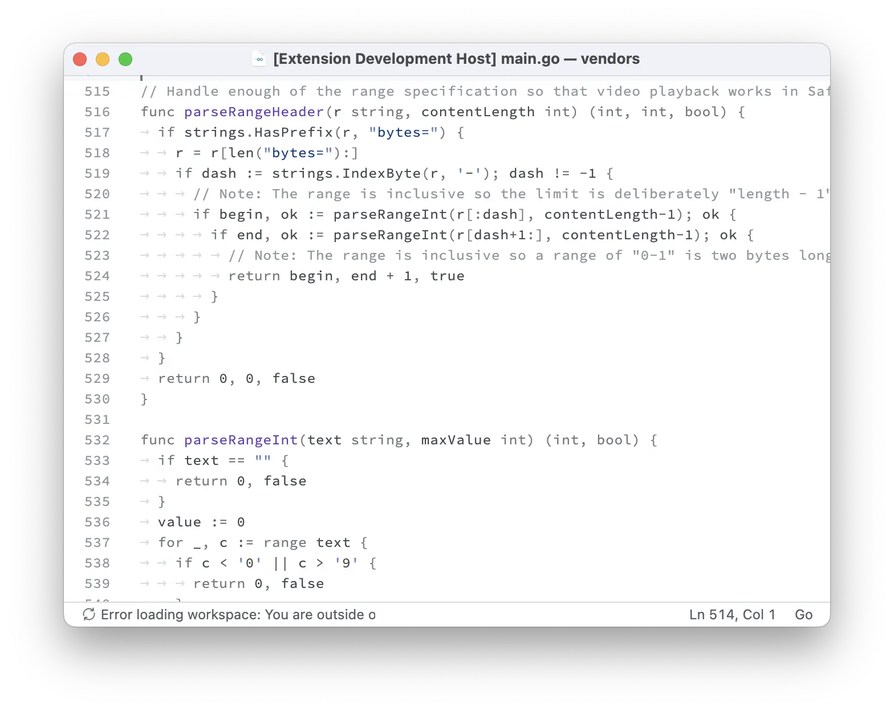

  <figcaption>
<a href="https://github.com/evanw/esbuild/blob/914f6080c77cfe32a54888caa51ca6ea13873ce9/pkg/api/serve_other.go">An elephant at sunset</a>
</figcaption>
</figure>
<figure>
  
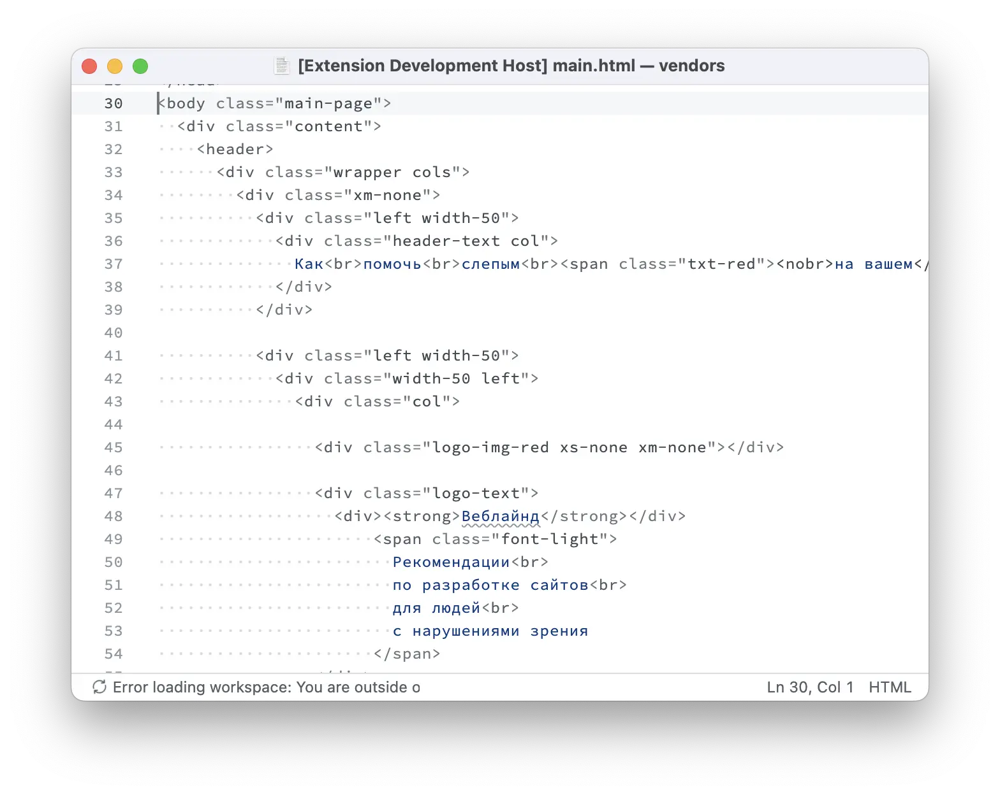

  <figcaption>
<a href="https://github.com/web-standards-ru/weblind.ru/blob/0dbda0150ba55ceb909eb9c8e0b9bbccf14ecbbc/src/index.html">An elephant at sunset</a>
</figcaption>
</figure>
<figure>
  
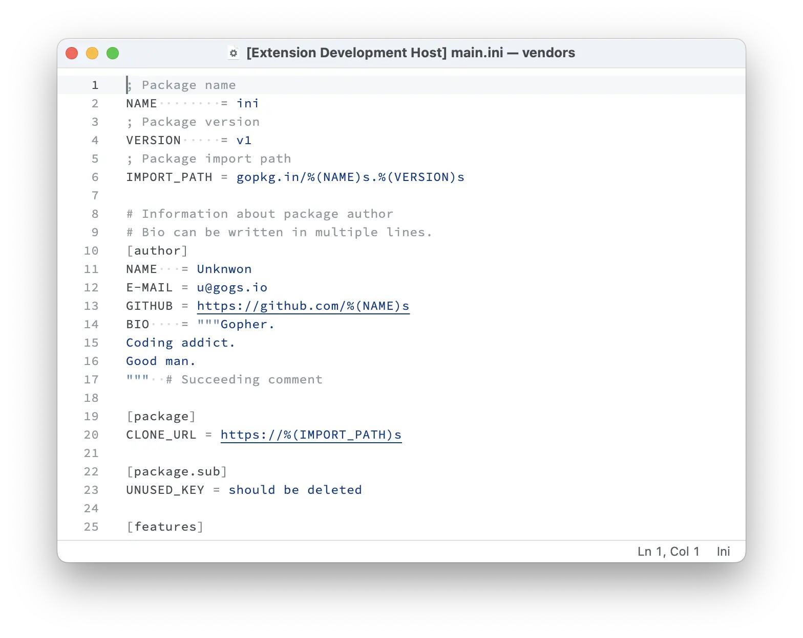

  <figcaption>
<a href="https://github.com/go-ini/ini/blob/b2f570e5b5b844226bbefe6fb521d891f529a951/testdata/full.ini">An elephant at sunset</a>
</figcaption>
</figure>
<figure>
  
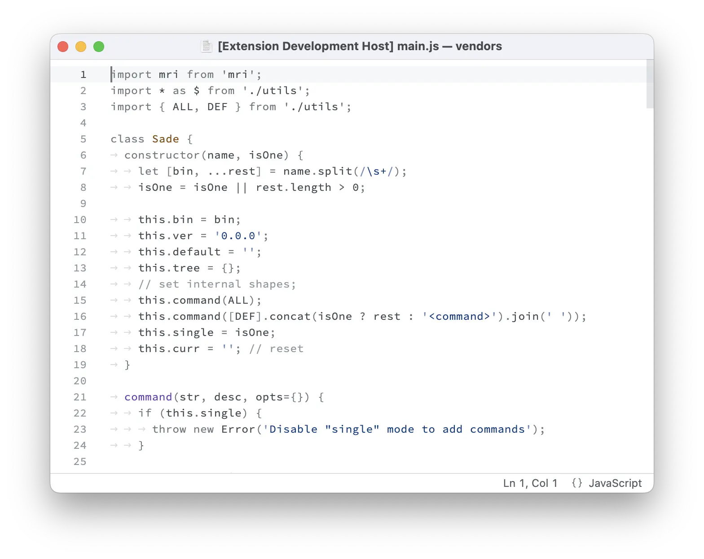

  <figcaption>
<a href="https://github.com/lukeed/sade/blob/cb05689a4b80668c5c2303efaff6e20ca53eb216/src/index.js">An elephant at sunset</a>
</figcaption>
</figure>
<figure>
  
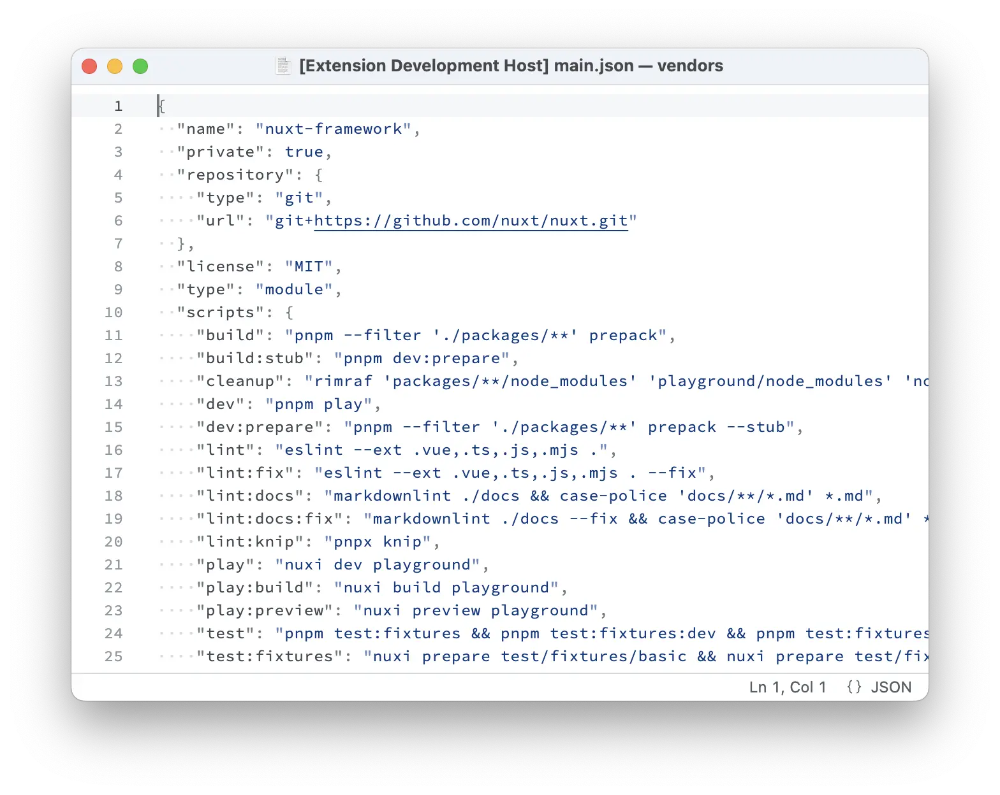

  <figcaption>
<a href="https://github.com/nuxt/nuxt/blob/29a765081aeb9c7ebad71cdea31362e9c0fd6925/package.json">An elephant at sunset</a>
</figcaption>
</figure>
<figure>
  
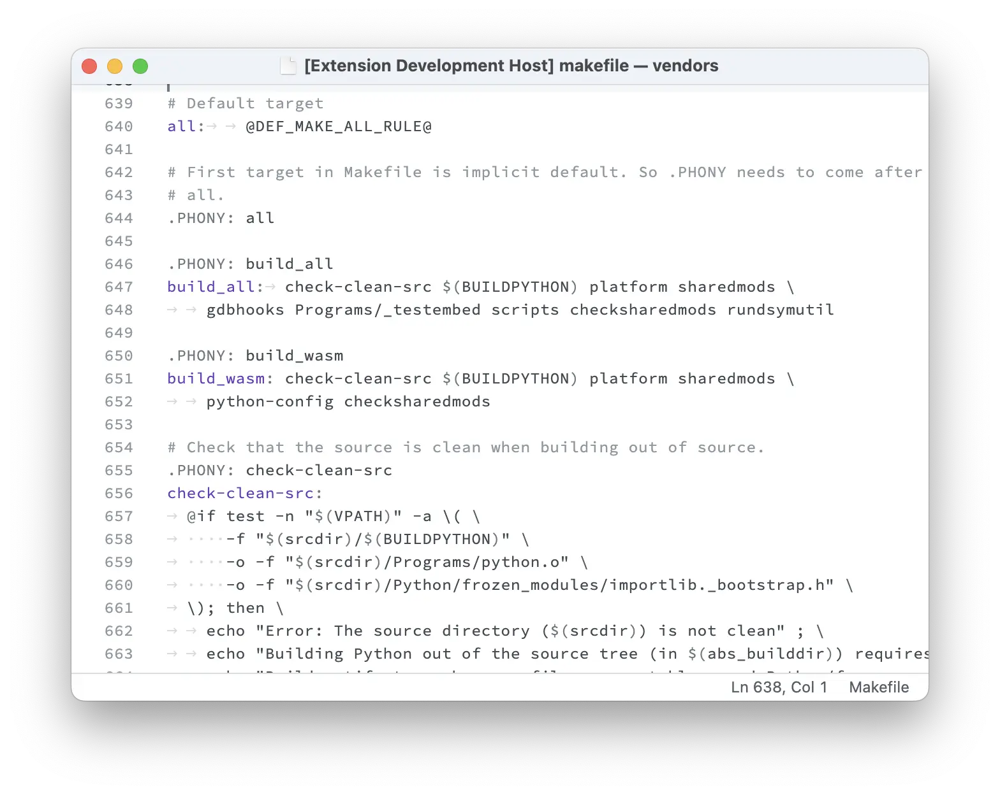

  <figcaption>
<a href="https://github.com/python/cpython/blob/f108468970bf4e70910862476900f924fb701399/Makefile.pre.in">An elephant at sunset</a>
</figcaption>
</figure>
<figure>
  
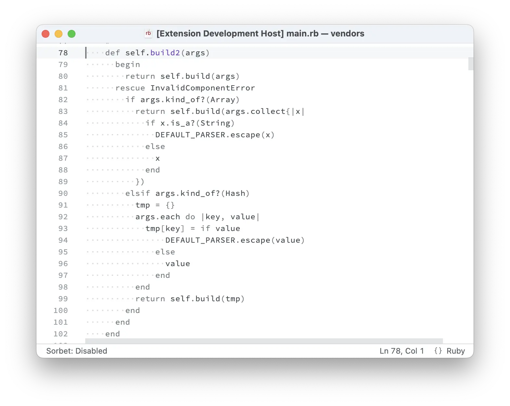

  <figcaption>
<a href="https://github.com/ruby/uri/blob/ec26408828b2e21fad2b5db6fff1d5f0c7b333b4/lib/uri/generic.rb">An elephant at sunset</a>
</figcaption>
</figure>
<figure>
  
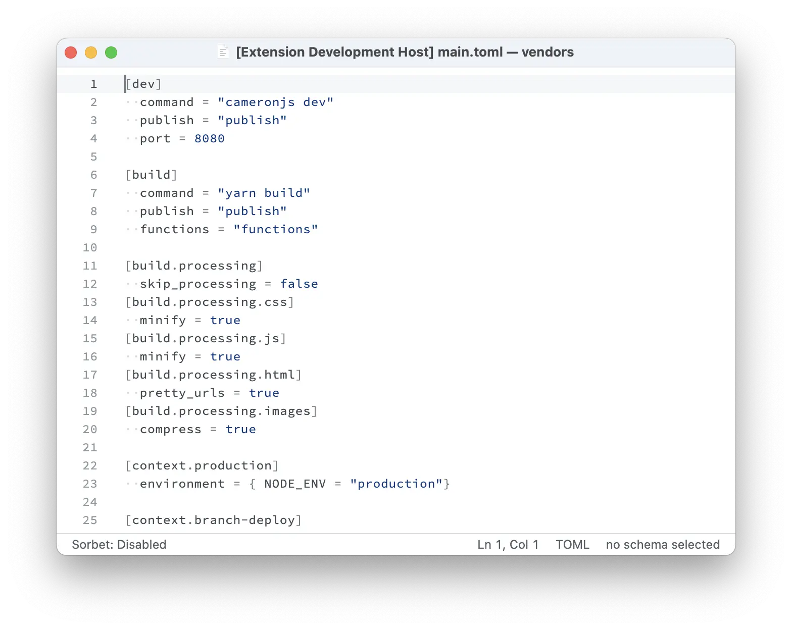

  <figcaption>
<a href="https://github.com/toml-lang/toml.io/blob/7144478eb1b47a5a8d80d2904e7176b8e9db2a08/netlify.toml">An elephant at sunset</a>
</figcaption>
</figure>
<figure>
  
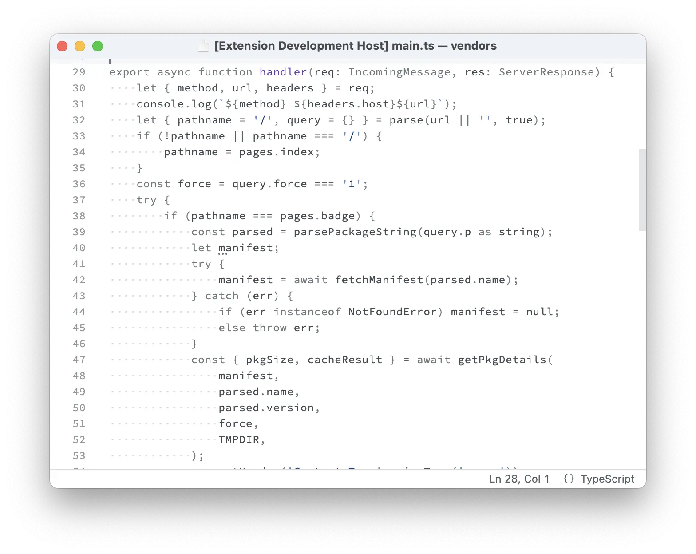

  <figcaption>
<a href="https://github.com/styfle/packagephobia/blob/514d7e030d1489dd1f24bbe0b29dbed84882791a/src/server.ts">An elephant at sunset</a>
</figcaption>
</figure>
<figure>
  
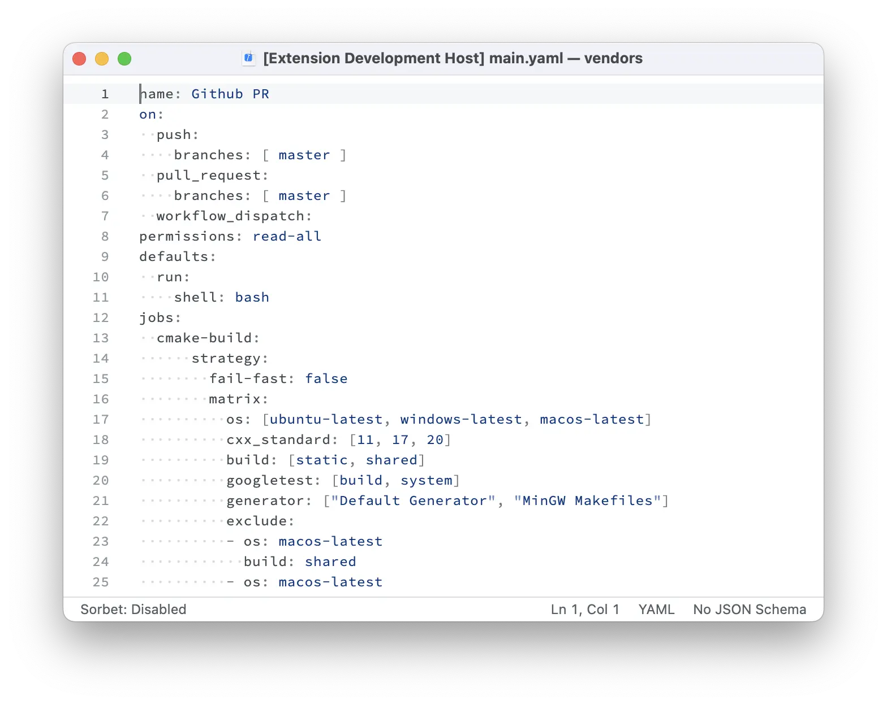

  <figcaption>
<a href="https://github.com/jbeder/yaml-cpp/blob/94710bb2213cb6793121eaaa4edfb15abcca7af9/.github/workflows/build.yml">An elephant at sunset</a>
</figcaption>
</figure>

## License

The repository code is distributed under the [MIT License](./LICENSE).
